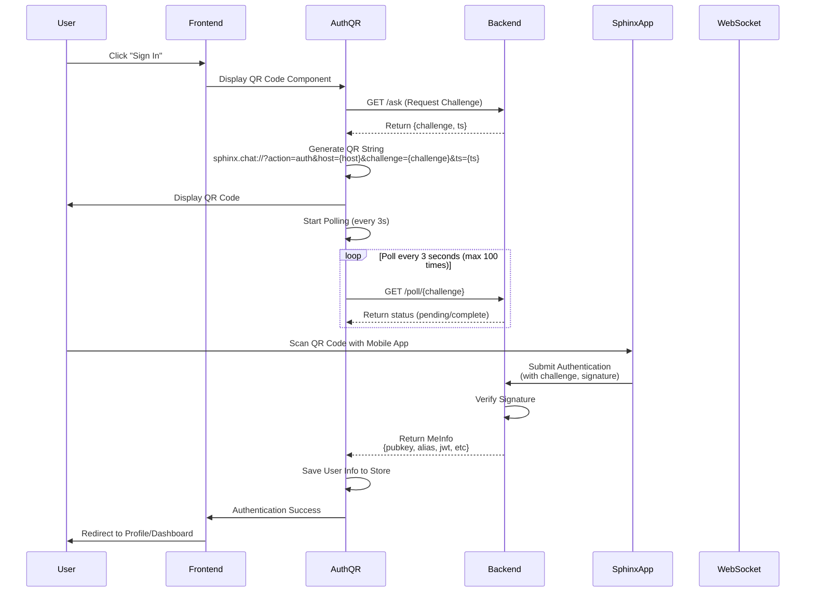
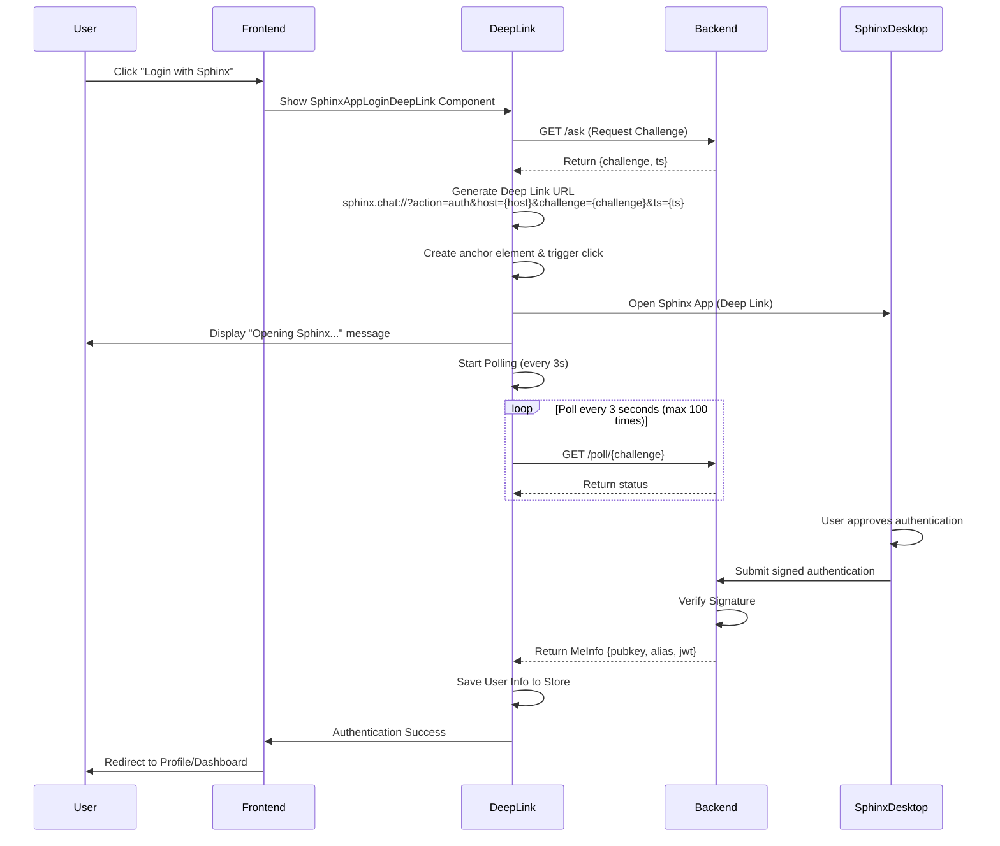
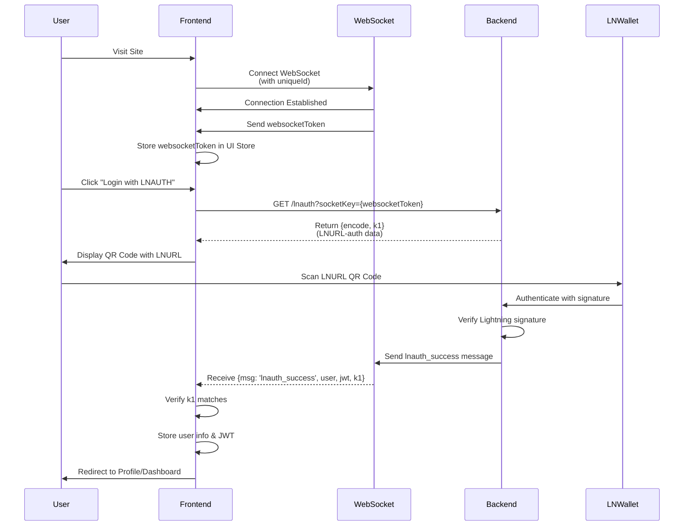

# Sphinx Tribes Frontend Authentication Workflow

## Overview

The Sphinx Tribes Frontend implements a multi-method authentication system that allows users to authenticate using Sphinx Chat. There are three primary authentication methods:

1. **QR Code Scanning** (Mobile Sphinx App)
2. **Deep Link** (Desktop Sphinx App)
3. **LNURL Authentication** (Lightning Wallet)

This document provides a detailed workflow of how each authentication method works.

---

## Architecture Components

### Key Files

- **`SignIn.tsx`** - Main authentication component that orchestrates the login flow
- **`AuthQR.tsx`** - Handles QR code-based authentication
- **`SphinxAppLoginDeepLink.tsx`** - Handles deep link authentication for desktop apps
- **`socket.ts`** - WebSocket configuration for real-time authentication updates
- **`main.ts` (store)** - Main store managing authentication state
- **`ui.ts` (store)** - UI store managing user info and WebSocket tokens

### Backend Endpoints

- `GET /ask` - Request authentication challenge
- `GET /poll/{challenge}` - Poll for authentication completion
- `GET /lnauth?socketKey={token}` - Get LNURL authentication data
- `POST /verify/{challenge}` - Verify authentication (used in testing)

---

## Authentication Method 1: QR Code Scanning (Mobile)

This method is used when users want to scan a QR code with their mobile Sphinx app.

### Flowchart



### Detailed Steps

1. **Initialization**
   - User clicks "Sign In" button
   - `SignIn.tsx` component renders
   - On desktop (non-mobile), `AuthQR` component is displayed

2. **Challenge Request**

   ```typescript
   // AuthQR.tsx
   async function getChallenge() {
     const res = await api.get("ask");
     if (res.challenge) {
       setChallenge(res.challenge);
       startPolling(res.challenge);
     }
     if (res.ts) {
       setTS(res.ts);
     }
   }
   ```

3. **QR Code Generation**
   - QR string format: `sphinx.chat://?action=auth&host={host}&challenge={challenge}&ts={ts}`
   - `host` is derived from the current environment (localhost, staging, production)
   - QR code is rendered using the `QR` component

4. **Polling Mechanism**

   ```typescript
   async function startPolling(challenge: string) {
     let i = 0;
     interval = setInterval(async () => {
       try {
         const me: MeInfo = await api.get(`poll/${challenge}`);
         if (me && me?.pubkey) {
           // Authentication successful
           await ui.setMeInfo(me);
           const person = formatRelayPerson(me);
           await main.saveProfile(person);
           await main.getSelf(me);

           setChallenge("");
           if (props.onSuccess) props.onSuccess();
           if (interval) clearInterval(interval);
         }
         i++;
         if (i > 100) {
           // Timeout after ~5 minutes
           if (interval) clearInterval(interval);
         }
       } catch (e) {
         console.log(e, "Error");
       }
     }, 3000); // Poll every 3 seconds
   }
   ```

5. **User Scans QR Code**
   - User opens Sphinx mobile app
   - Scans the displayed QR code
   - Mobile app extracts challenge and host from QR data
   - Mobile app signs the challenge with user's private key
   - Mobile app sends authentication to backend

6. **Authentication Completion**
   - Backend verifies the signature
   - Backend returns user information (MeInfo)
   - Frontend receives user data via polling
   - User info is stored in MobX store
   - `onSuccess` callback is triggered
   - User is redirected to their profile

---

## Authentication Method 2: Deep Link (Desktop App)

This method is used when users have Sphinx desktop app installed and click "Login with Sphinx".

### Flowchart



### Detailed Steps

1. **User Interaction**
   - User clicks "Login with Sphinx" button
   - `showSignIn` state is set to `true`
   - `SphinxAppLoginDeepLink` component is rendered

2. **Challenge Request**

   ```typescript
   // SphinxAppLoginDeepLink.tsx
   async function getChallenge() {
     const res = await api.get("ask");
     if (res.challenge) {
       setChallenge(res.challenge);
       startPolling(res.challenge);
     }
     if (res.ts) {
       setTS(res.ts);
     }
   }
   ```

3. **Deep Link Trigger**

   ```typescript
   useEffect(() => {
     if (challenge && ts) {
       const el = document.createElement("a");
       el.href = qrString; // sphinx.chat://?action=auth&...
       el.click();
     }
   }, [challenge, ts]);
   ```

   - Creates a virtual anchor element
   - Sets href to the deep link URL
   - Programmatically clicks it to open Sphinx app

4. **Polling for Authentication**
   - Same polling mechanism as QR code method
   - Polls every 3 seconds for up to 100 iterations (~5 minutes)
   - Checks `/poll/{challenge}` endpoint

5. **Desktop App Authentication**
   - Sphinx desktop app opens automatically
   - Displays authentication prompt to user
   - User approves/denies the authentication request
   - App signs the challenge with user's private key
   - Sends signed authentication to backend

6. **Completion**
   - Frontend receives user info via polling
   - User data stored in MobX store
   - Success callback triggered
   - User redirected to profile

---

## Authentication Method 3: LNURL Authentication

This method allows users with Lightning wallets (supporting LNURL-auth) to authenticate.

### Flowchart



### Detailed Steps

1. **WebSocket Initialization**

   ```typescript
   // SignIn.tsx
   useEffect(() => {
     const socket: WebSocket = createSocketInstance();
     socket.onopen = () => {
       console.log("Socket connected");
     };

     socket.onmessage = (event: MessageEvent) => {
       onHandle(event);
     };

     socket.onclose = () => {
       console.log("Socket disconnected");
     };
   }, []);
   ```

2. **WebSocket Token Management**

   ```typescript
   // socket.ts
   export const createSocketInstance = (): WebSocket => {
     const websocketToken = localStorage.getItem("websocket_token");
     let uniqueID = websocketToken;

     if (uniqueID === null || uniqueID === "") {
       uniqueID = uuidv4();
       localStorage.setItem("websocket_token", uniqueID!);
     }

     socket = new WebSocket(`${URL}?uniqueId=${uniqueID}`);
     return socket;
   };
   ```

3. **LNURL Request**

   ```typescript
   // main.ts
   async getLnAuth(): Promise<LnAuthData> {
     try {
       const data = await api.get(`lnauth?socketKey=${uiStore.websocketToken}`);
       this.setLnAuth(data);
       return data;
     } catch (e) {
       console.log('Error getLnAuth', e);
       return { encode: '', k1: '' };
     }
   }
   ```

4. **Display LNURL QR Code**
   - Frontend displays QR code with LNURL-auth `encode` string
   - User scans with Lightning wallet that supports LNURL-auth

5. **WebSocket Message Handling**

   ```typescript
   const onHandle = (event: any) => {
     const res = JSON.parse(event.data);
     ui.setWebsocketToken(res.body);

     if (res.msg === SOCKET_MSG.user_connect) {
       const user = ui.meInfo;
       if (user) {
         user.websocketToken = res.body;
         ui.setMeInfo(user);
       }
     } else if (res.msg === SOCKET_MSG.lnauth_success && res.k1 === main.lnauth.k1) {
       if (res.status) {
         ui.setShowSignIn(false);
         ui.setMeInfo({ ...res.user, tribe_jwt: res.jwt, jwt: res.jwt });
         ui.setSelectedPerson(res.id);

         main.setLnAuth({ encode: "", k1: "" });
         main.setLnToken(res.jwt);
       }
     }
   };
   ```

6. **Authentication Success**
   - Backend sends success message via WebSocket
   - Frontend validates `k1` matches the original request
   - User info and JWT token stored
   - User is authenticated and redirected

---

## State Management

### MobX Stores

#### UI Store (`ui.ts`)

```typescript
interface MeInfo {
  id?: number;
  pubkey?: string;
  owner_alias?: string;
  owner_pubkey?: string;
  photo_url?: string;
  alias?: string;
  description?: string;
  tags?: string[];
  img?: string;
  jwt?: string;
  tribe_jwt?: string;
  url?: string;
  websocketToken?: string;
  // ... other fields
}

class UIStore {
  websocketToken = "";
  _meInfo: MeData = null;

  setWebsocketToken(s: string) {
    this.websocketToken = s;
  }

  setMeInfo(t: MeData) {
    if (t && t.owner_pubkey) {
      mainStore.getSelf(t);
    }
    this.meInfo = t;
  }

  get meInfo() {
    if (this._meInfo && this._meInfo.owner_pubkey) {
      return {
        ...this._meInfo,
        img: this._meInfo.img || getUserAvatarPlaceholder(this._meInfo.owner_pubkey),
      };
    }
    return null;
  }
}
```

#### Main Store (`main.ts`)

```typescript
class MainStore {
  lnauth: LnAuthData = { encode: "", k1: "" };

  async getLnAuth(): Promise<LnAuthData> {
    const data = await api.get(`lnauth?socketKey=${uiStore.websocketToken}`);
    this.setLnAuth(data);
    return data;
  }

  setLnAuth(lnData: LnAuthData) {
    this.lnauth = lnData;
  }

  async saveProfile(person: Person) {
    // Save user profile to backend
  }

  async getSelf(meInfo: MeInfo) {
    // Fetch complete user profile
  }
}
```

---

## WebSocket Communication

### Connection Setup

```typescript
// socket.ts
const URL = (() => {
  const isCodespaces =
    window.location.hostname.includes("app.github.dev") ||
    window.location.hostname.includes("workspaces.sphinx.chat");

  if (isCodespaces) {
    return `wss://${getHost()}/websocket`;
  }

  return process.env.NODE_ENV !== "development"
    ? `wss://${getHost()}/websocket`
    : `ws://${getHost()}/websocket`;
})();
```

### Message Types

```typescript
export const SOCKET_MSG = {
  keysend_error: "keysend_error",
  keysend_failed: "keysend_failed",
  keysend_pending: "keysend_pending",
  keysend_success: "keysend_success",
  invoice_success: "invoice_success",
  payment_success: "payment_success",
  assign_success: "assign_success",
  lnauth_success: "lnauth_success", // Used for LNURL auth
  user_connect: "user_connect", // WebSocket connection established
  budget_success: "budget_success",
};
```

---

## Security Considerations

### Challenge-Response Authentication

1. **Challenge Generation**: Backend generates a unique challenge string
2. **Timestamp**: Includes timestamp (`ts`) to prevent replay attacks
3. **Signature Verification**: User's Sphinx app signs the challenge with their private key
4. **Server Verification**: Backend verifies the signature matches the user's public key

### Token Management

- **JWT Tokens**: Used for authenticated API requests
- **WebSocket Tokens**: Unique per session, tied to user's connection
- **Session Management**: Session IDs tracked via PostHog and sessionStorage

### Polling Security

- **Timeout**: Maximum 100 iterations (~5 minutes) prevents indefinite polling
- **Interval Cleanup**: Properly clears intervals on unmount or success
- **Challenge Uniqueness**: Each authentication attempt uses a unique challenge

---

## Deep Link URL Structure

### Authentication Deep Links

```
sphinx.chat://?action=auth&host={host}&challenge={challenge}&ts={ts}
```

**Parameters:**

- `action=auth` - Indicates authentication action
- `host={host}` - Backend host (e.g., people.sphinx.chat, localhost:5002)
- `challenge={challenge}` - Unique challenge string from backend
- `ts={ts}` - Timestamp for replay attack prevention

### Other Deep Link Types

#### Connect with User

```
sphinx.chat://?action=person&host={host}&pubkey={pubkey}
```

#### Join Tribe

```
sphinx.chat://?action=tribe&uuid={uuid}&host={host}
```

---

## Error Handling

### Polling Errors

- Network failures are logged but don't stop polling
- Timeout after 100 iterations (5 minutes)
- Interval is properly cleaned up on component unmount

### WebSocket Errors

```typescript
socket.onclose = () => {
  console.log("WebSocket connection closed");
  setTimeout(createSocketInstance, 500); // Reconnect after 500ms
};

socket.onerror = (error: any) => {
  console.error("WebSocket error:", error);
  setTimeout(createSocketInstance, 1000); // Reconnect after 1s
};
```

### Authentication Failures

- No user data received after timeout
- Invalid signature verification
- Network connectivity issues

---

## Mobile vs Desktop Behavior

### Mobile Detection

```typescript
const isMobile = useIsMobile();
```

### Conditional Rendering

```typescript
{page === 'lnurl' ? (
  <QR value={main.lnauth.encode.toLocaleUpperCase()} size={200} />
) : (
  !isMobile && (
    <AuthQR
      onSuccess={async () => {
        if (props.onSuccess) props.onSuccess();
        main.getPeople({ resetPage: true });
      }}
      style={{ marginBottom: 20 }}
    />
  )
)}
```

**Mobile Behavior:**

- Shows Sphinx logo
- Primary method is QR code scanning
- LNAUTH option available

**Desktop Behavior:**

- Shows QR code for scanning with mobile app
- "Login with Sphinx" button triggers deep link
- LNAUTH option available
- Test user login available in development mode

---

## Development Tools

### Test User Login

```typescript
// Only available in development
{isDevHost() && (
  <IconButton
    text={'Login as Test User'}
    onClick={() => handleTestUserLogin()}
    loading={testUserLogin}
  />
)}
```

### Test User Authentication

```typescript
async function handleTestUserLogin() {
  setTestUserLogin(true);
  await testUserLnUrlLogin(main.lnauth.encode.toLocaleUpperCase());
  setTestUserLogin(false);
}
```

This simulates LNURL authentication with a test cryptographic key for development/testing purposes.

---

## Summary

The Sphinx Tribes authentication system provides three robust methods for user authentication:

1. **QR Code Scanning** - Best for mobile users with Sphinx app installed
2. **Deep Link** - Best for desktop users with Sphinx app installed
3. **LNURL Authentication** - Compatible with any Lightning wallet supporting LNURL-auth

All methods use:

- Challenge-response authentication for security
- Polling mechanism to check authentication status
- WebSocket for real-time updates (LNURL method)
- JWT tokens for session management
- MobX stores for state management

The system is designed to be secure, user-friendly, and compatible with both mobile and desktop environments.
